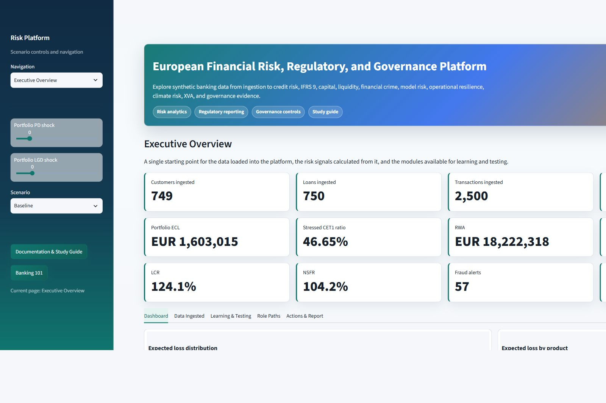
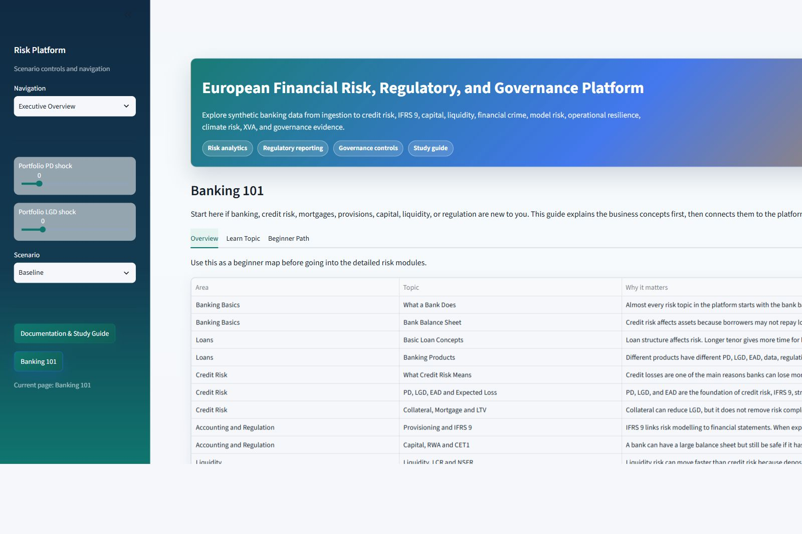
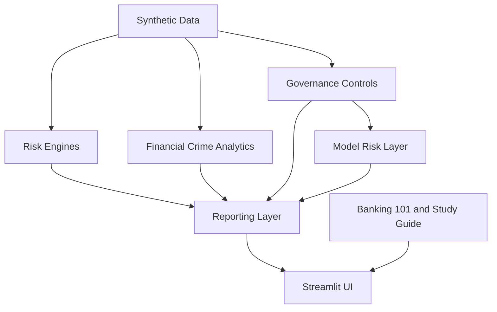

# European Banking Risk & Governance Lab

An independent educational banking risk, regulatory reporting, data governance and model-risk platform built with Python and Streamlit using synthetic data.

Live demo: https://ragunath1242001-finanical-modelling-app-k7vjy7.streamlit.app/

This project is an educational portfolio demonstration. It is not a production banking system, formal regulatory reporting engine, accounting system, legal interpretation or compliance certification.

## Demo

Run locally:

```powershell
python -m venv .venv
.\.venv\Scripts\Activate.ps1
pip install -r requirements.txt
streamlit run app.py
```

Screenshots currently available:





Additional screenshot capture instructions are in [docs/screenshots_checklist.md](docs/screenshots_checklist.md).

## Executive Overview

The platform shows how a synthetic banking portfolio moves through the full risk and governance chain:

```text
Banking foundations
-> PD/LGD/EAD
-> IFRS 9 ECL
-> provisions and CET1
-> capital and reporting
-> BCBS 239 data governance
-> model-risk monitoring
-> auditability
-> executive decision support
```

The aim is to make technical banking concepts visible, testable and explainable for portfolio review and interview preparation.

## Key Capabilities

### Banking And Credit Risk

- Banking 101 for users starting from zero.
- Borrower-level PD, LGD, EAD and expected loss.
- Logistic-regression PD model and gradient-boosting challenger.
- ROC, AUC, Brier score, calibration, confusion matrix, feature importance and PSI.

### IFRS 9 And Capital

- IFRS 9 educational Stage 1/2/3 rules.
- 12-month and lifetime ECL.
- Scenario-weighted ECL.
- Provision bridge and CET1 bridge.
- Basel capital ratios, standardised RWA and educational IRB comparison.
- CRR3 output-floor illustration.

### Stress And Liquidity

- Macro stress testing from PD/LGD/EAD to ECL and capital ratio impact.
- Reverse stress testing.
- LCR, NSFR and leverage ratio.

### Regulatory Reporting

- COREP-style capital view.
- FINREP-style financial view.
- Reporting-readiness status.
- Risk-versus-Finance reconciliation.

### BCBS 239 And Data Governance

- Completeness, accuracy, consistency, timeliness, validity, uniqueness, integrity and traceability controls.
- Synthetic defects and failed-record samples.
- 1LOD remediation, 2LOD challenge, 3LOD audit-review context.
- Evidence, issue lifecycle and audit logging.
- Data lineage and ownership catalogue.

### Model Risk And Monitoring

- Typed model inventory and model versions.
- Model tiering, lifecycle status and approval decisions.
- Development evidence and independent validation.
- Findings, limitations, use restrictions and revalidation triggers.
- Monitoring thresholds, PSI drift and champion-challenger comparison.
- Explainability outputs and model confidence on Credit Risk / IFRS 9 pages.

### Financial Crime And Emerging Risk

- Fraud alert scoring and threshold learning.
- AML rule-based monitoring.
- EU AI Act-style control assessment.
- DORA operational-resilience simulator.
- ESG climate credit-risk overlay.
- XVA counterparty-risk mini model.

### Learning And Interview Preparation

- Global Standard View / Learning View selector.
- Banking 101.
- Documentation and Study Guide.
- End-to-end case studies.
- Glossary, formulas, model cards, interview guide and talking points.

## End-To-End Use Cases

### Credit-Risk Chain

```text
PD/LGD/EAD
-> ECL
-> provision
-> CET1
-> capital ratio
-> COREP/FINREP-style reporting
```

### Governance Chain

```text
Data-quality failure
-> issue creation
-> 1LOD remediation
-> 2LOD challenge
-> closure evidence
-> audit trail
```

### Model-Risk Chain

```text
Calibration deterioration
-> monitoring breach
-> validation finding
-> use restriction
-> revalidation trigger
-> executive reporting
```

## Architecture



Dependency direction:

```text
UI pages -> domain services -> reporting/governance/model-risk modules -> synthetic data or local SQLite
```

The root `app.py` is a thin entry point. Page renderers live under `src/ui/pages/`. Financial calculations live under `src/risk/`. Governance and model-risk logic live under `src/governance/` and `src/model_risk/`.

## Repository Structure

```text
app.py
requirements.txt
data/synthetic/
docs/
src/
  data/
  risk/
  governance/
  model_risk/
  reporting/
  financial_crime/
  forecasting/
  ui/
tests/
```

## Methodology And Assumptions

Detailed methodology is documented in:

- [docs/financial_assumptions.md](docs/financial_assumptions.md)
- [docs/formulas.md](docs/formulas.md)
- [docs/model_cards.md](docs/model_cards.md)
- [docs/bcbs239.md](docs/bcbs239.md)
- [docs/model_risk_management.md](docs/model_risk_management.md)

## Testing

Latest local validation:

```text
103 passed
70% source coverage
Streamlit startup probe: HTTP 200
All registered pages rendered with AppTest
```

Run tests:

```powershell
.\.venv\Scripts\python -m pytest -q
.\.venv\Scripts\python -m pytest --cov=src --cov-report=term-missing
.\.venv\Scripts\python -m compileall -q app.py src tests
.\.venv\Scripts\python -c "import app; print('app import ok')"
```

## Technology Stack

- Python
- Streamlit
- pandas
- NumPy
- scikit-learn
- Plotly
- ReportLab
- pytest and pytest-cov
- local SQLite for the educational audit log

## Synthetic Data Statement

All customer, loan, transaction, financial, governance and model-risk records are synthetic. The data intentionally includes defects such as missing income, invalid risk parameters, stale collateral, reconciliation differences and model-monitoring issues so the governance workflows have something realistic to detect.

## Limitations

This project is not:

- a production credit-risk model;
- a formal IFRS 9 accounting engine;
- a Basel or CRR regulatory capital engine;
- a COREP or FINREP submission tool;
- a legal interpretation of EU AI Act, DORA, Basel, CRR3 or IFRS 9;
- an employer, bank, regulator or client system;
- a system using real customer data.

The formulas, thresholds and workflows are simplified educational approximations.

## Interview Value

This project demonstrates practical ability to connect:

- banking-risk concepts;
- Python modelling and validation;
- data quality and reconciliation;
- model monitoring and drift;
- governance, evidence and auditability;
- executive-level risk interpretation.

See [docs/portfolio_talking_points.md](docs/portfolio_talking_points.md), [docs/interview_guide.md](docs/interview_guide.md) and [docs/cv_linkedin_examples.md](docs/cv_linkedin_examples.md).

## Deployment

Deployment notes are in [docs/deployment.md](docs/deployment.md). Streamlit Community Cloud can run the app from the root `app.py` with `requirements.txt`.

## Licence

This repository includes an Apache License 2.0 file.
